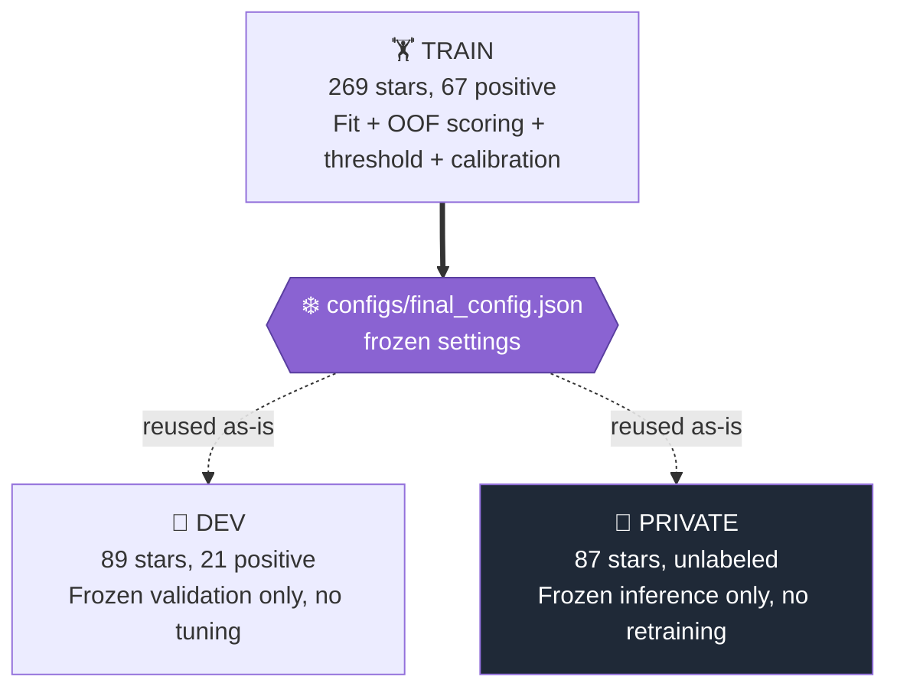
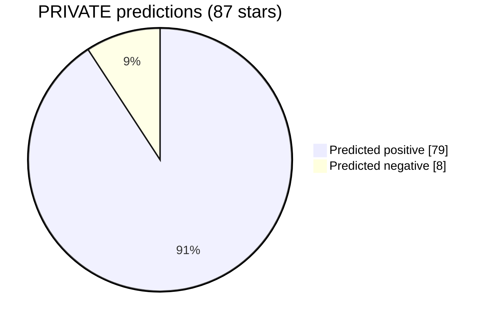

<div align="center">



### Find planets hiding in starlight, without peeking at the answers.


-blue?style=for-the-badge)

**[Quick Start](#-quick-start)** ·
**[How It Works](#-how-it-works)** ·
**[Results](#-results)** ·
**[Leakage Controls](#-no-peeking-leakage-controls)** ·
**[Glossary](#-plain-english-glossary)**

</div>

---

## 🌌 What is Astro?

Astro is an **exoplanet-detection pipeline** (a chain of programs that turns raw telescope brightness data into a list of "this star probably has a planet" guesses) built for **NASA Kepler** data.

When a planet passes in front of its star, the star dims by a tiny, regular amount. This event is called a **transit** (a planet crossing the face of its star, like a small shadow). Astro finds those repeating dips automatically.

It combines two ideas:

- 🧱 **A Parquet-native, quarter-aware preprocessing core.** *Parquet* is a compact, fast column-based file format. *Quarter-aware* means each Kepler observing quarter (roughly 3 months of data) is cleaned on its own, because the telescope was re-oriented between quarters and brightness levels jump.
- 🔍 **An in-house optimized BLS search.** *BLS* (Box Least Squares) is a method that slides a box-shaped dip across the data at many trial periods to find the one that fits best.

> [!NOTE]
> This README separates **implemented production behavior** from historical or exploratory notes found in the repository. Anything described here as "frozen" is what actually produced `submission.csv`.

---

## ✨ Highlights

| | Feature | In plain words |
|---|---|---|
| 🛰️ | **Quarter-aware normalization** | Brightness is rescaled per Kepler quarter, so jumps between quarters are not mistaken for transits. |
| 🧹 | **Gap-aware detrending** (removing slow drifts) | A 2-day rolling median is applied per quarter and per large gap, never across them. |
| ⚡ | **Optimized BLS** | Custom code searches 3–400 day periods using at most 512 log-spaced trial periods and 8 durations. |
| 🧮 | **16-value feature vector** | Each candidate is summarized as 16 numbers (depth, SNR, odd/even match, recurrence, shape, and more). |
| 📏 | **Isotonic calibration** | Confidence scores are reshaped so "0.8" behaves more like "about 80% likely" without changing the yes/no cutoff. |
| 🔒 | **Blind preprocessing** | The preprocessor only ever sees flux data. It never receives labels, period, epoch, depth, or duration. |
| ♻️ | **Deterministic output** | Two runs on PRIVATE produce byte-for-byte identical CSVs (same SHA-256 hash). |

---

## 🗺️ How It Works

### The 11-stage pipeline

```mermaid
flowchart LR
    subgraph PREP["🧹 Preprocessing"]
        A["1. Raw Parquet<br/>time, flux, quality, quarter"] --> B["2. Quality control<br/>quality = 0, min 1000 pts"]
        B --> C["3. Quarter normalize<br/>divide by robust median"]
        C --> D["4. Detrend<br/>2-day rolling median"]
    end
    subgraph DET["🔍 Detection"]
        E["5. BLS search<br/>3 to 400 days, 8 durations"] --> F["6. Candidate features<br/>16 values"]
    end
    subgraph DEC["⚖️ Decision"]
        G["7. Score<br/>statistical BLS"] --> H["8. Isotonic<br/>calibration"] --> I["9. Freeze<br/>threshold 0.19"]
    end
    subgraph OUT["📤 Output"]
        J["10. PRIVATE<br/>inference"] --> K["11. submission.csv<br/>87 rows, validated"]
    end
    D --> E
    F --> G
    I --> J
    style K fill:#2ea44f,color:#fff,stroke:#1a7f37
    style I fill:#8a63d2,color:#fff,stroke:#5a3fa0
```



### Stage-by-stage reference

<details>
<summary><b>📋 Click to expand the full stage table</b></summary>

<br/>

| # | Stage | Method / parameters | Output |
|---|---|---|---|
| 1 | Raw input | Read Parquet: `time, flux, flux_err, quality, quarter` | Raw DataFrame (a table in memory) |
| 2 | Quality control | `quality == 0`; cadence (time between measurements) 29.4 min; gap > 3× cadence; min 1000 points | Clean arrays |
| 3 | Quarter normalize | Divide each quarter by its robust median flux (a middle value that ignores outliers) | `norm_flux`, `norm_err` |
| 4 | Detrend | Quarter/gap-aware robust rolling median, 2.0-day window | `detrended_flux`, `baseline` |
| 5 | BLS search | 3–400 day range, ≤512 log-spaced periods, 8 durations (1–24 h) | ≤10 candidates per star |
| 6 | Candidate features | 16 features: SDE, depth, SNR, odd/even, recurrence, shape… | Feature vectors |
| 7 | Scoring | Statistical: `sigmoid(0.8 × (SDE − 5))`; a logistic model is also trained | Raw confidence |
| 8 | Calibration | Custom isotonic (PAV) fit on out-of-fold scores | Calibrated confidence |
| 9 | Freeze | TRAIN-only threshold selection → **0.19** on the statistical score | Frozen decision rule |
| 10 | PRIVATE inference | Frozen config reused; no retraining, tuning, or calibration refit | 87 predictions |
| 11 | Submission | 6-column CSV + strict schema and content validation | `submission.csv` |

> **Terms:** *SDE* (Signal Detection Efficiency, a number saying how much the best period stands out from the noise) · *SNR* (Signal-to-Noise Ratio, signal strength compared with random scatter) · *PAV* (Pool Adjacent Violators, the algorithm that builds the isotonic curve) · *OOF* (Out-Of-Fold, predictions made on data the model did not train on).

</details>

### The scoring rule, in math

The production decision uses the **statistical BLS score** (not the machine-learning model). It squashes SDE into a 0–1 confidence with a **sigmoid** (an S-shaped curve that maps any number to a value between 0 and 1):

$$
\text{score}(\text{SDE}) \;=\; \frac{1}{1 + e^{-0.8\,(\text{SDE} - 5)}}
$$

A star is predicted to host a transit when its score is at least the frozen threshold:

$$
\hat{y} \;=\; \mathbf{1}\big[\,\text{score} \ge 0.19\,\big]
$$

Solving for the SDE that gives a score of 0.19 shows the cutoff is quite permissive (a low bar for saying "yes"):

$$
\text{SDE}^{*} \;=\; 5 + \frac{1}{0.8}\ln\!\left(\frac{0.19}{1-0.19}\right) \;\approx\; 3.19
$$

That permissive cutoff is a deliberate trade: it catches almost every real planet (high recall) at the cost of more false alarms (modest precision).

### The BLS idea, in 3D

BLS models a transit as a simple **box**: flat, then a sudden drop, then flat again. Here is that box as an interactive 3D model. Drag to rotate it.

```stl
solid bls_box
  facet normal 0 0 -1
    outer loop
      vertex 0 0 0
      vertex 0 1 0
      vertex 1 1 0
    endloop
  endfacet
  facet normal 0 0 -1
    outer loop
      vertex 0 0 0
      vertex 1 1 0
      vertex 1 0 0
    endloop
  endfacet
  facet normal 0 0 1
    outer loop
      vertex 0 0 1
      vertex 1 0 1
      vertex 1 1 1
    endloop
  endfacet
  facet normal 0 0 1
    outer loop
      vertex 0 0 1
      vertex 1 1 1
      vertex 0 1 1
    endloop
  endfacet
  facet normal 0 -1 0
    outer loop
      vertex 0 0 0
      vertex 1 0 0
      vertex 1 0 1
    endloop
  endfacet
  facet normal 0 -1 0
    outer loop
      vertex 0 0 0
      vertex 1 0 1
      vertex 0 0 1
    endloop
  endfacet
  facet normal 0 1 0
    outer loop
      vertex 0 1 0
      vertex 0 1 1
      vertex 1 1 1
    endloop
  endfacet
  facet normal 0 1 0
    outer loop
      vertex 0 1 0
      vertex 1 1 1
      vertex 1 1 0
    endloop
  endfacet
  facet normal -1 0 0
    outer loop
      vertex 0 0 0
      vertex 0 0 1
      vertex 0 1 1
    endloop
  endfacet
  facet normal -1 0 0
    outer loop
      vertex 0 0 0
      vertex 0 1 1
      vertex 0 1 0
    endloop
  endfacet
  facet normal 1 0 0
    outer loop
      vertex 1 0 0
      vertex 1 1 0
      vertex 1 1 1
    endloop
  endfacet
  facet normal 1 0 0
    outer loop
      vertex 1 0 0
      vertex 1 1 1
      vertex 1 0 1
    endloop
  endfacet
endsolid bls_box
```

---

## 🔒 No-Peeking: Leakage Controls

**Data leakage** (accidentally letting the model see answers it should not) is the quiet killer of detection projects. Astro is built to prevent it.



- ✅ Preprocessing never receives period, epoch, depth, duration, or label.
- ✅ Per-star normalization and detrending statistics are computed independently.
- ✅ Classifier training and threshold selection use **TRAIN out-of-fold** predictions only.
- ✅ Calibration is fit on out-of-fold scores, not in-sample model scores.
- ✅ DEV and PRIVATE labels are never used for tuning.
- ✅ PRIVATE inference reuses the frozen TRAIN configuration with no retraining.

---

## 📊 Results

### Confusion-matrix metrics at the frozen threshold (0.19)

| Split | Stars | TP | FP | FN | TN | Precision | Recall | F1 | Positive preds |
|---|---:|---:|---:|---:|---:|---:|---:|---:|---:|
| **TRAIN** | 269 | 66 | 189 | 1 | 13 | 0.259 | 0.985 | 0.410 | 255 |
| **DEV** | 89 | 20 | 63 | 1 | 5 | 0.241 | 0.952 | 0.385 | 83 |

> **Terms:** *TP* (true positive, a real planet star correctly flagged) · *FP* (false positive, a false alarm) · *FN* (false negative, a missed planet) · *TN* (true negative, correctly ignored) · *Precision* (of the stars flagged, how many were real) · *Recall* (of the real ones, how many were found) · *F1* (one number blending precision and recall).

**Recall on DEV (frozen, never tuned on):**

<progress value="95.2" max="100"></progress> **95.2%** &nbsp;(20 of 21 real positives found)

**Recall on TRAIN:**

<progress value="98.5" max="100"></progress> **98.5%** &nbsp;(66 of 67 real positives found)

> [!IMPORTANT]
> The pattern is **high recall, modest precision**. Nearly every true planet is recovered, but many negatives also receive strong statistical transit scores at 0.19. Treat positives as a **shortlist for follow-up**, not confirmed planets.

### PRIVATE run (unlabeled, inference only)



| Input files | Positive preds | Negative preds | Missing IDs | Duplicate IDs | Accuracy |
|---:|---:|---:|---:|---:|---|
| 87 | 79 | 8 | 0 | 0 | Unavailable (no PRIVATE labels provided) |

The root `submission.csv` matches the frozen PRIVATE-run and repeat-run outputs **byte-for-byte** (identical SHA-256 hashes), so inference is deterministic and reproducible.

> [!WARNING]
> **Conflicting artifact:** an older file, `bls_diagnostics_summary.json`, reports zero period matches. It is an earlier candidate-diagnostic snapshot taken *before* the final run and is **not** the production result. The authoritative numbers come from `train_final_metrics.json`, `dev_final_metrics.json`, and `private_predictions_audit.json`.

---

## ❄️ Frozen Production Policy

<dl>
  <dt><b>Score source</b></dt>
  <dd>Statistical BLS score (not the logistic model).</dd>

  <dt><b>Decision threshold</b></dt>
  <dd>0.19, in raw statistical-score space.</dd>

  <dt><b>Logistic model</b></dt>
  <dd>Trained and evaluated, but <b>rejected</b> because of weaker TRAIN out-of-fold F1.</dd>

  <dt><b>Calibration effect</b></dt>
  <dd>Changes the <i>reported confidence</i> only; it does not move the decision boundary.</dd>

  <dt><b>XGBoost</b></dt>
  <dd>Unavailable in this environment, so not used.</dd>
</dl>

---

## 🧹 Detrending: Used vs. Not Used

*Detrending* means removing slow brightness drifts (from the telescope or star) so only sharp, transit-like dips remain.

| Status | Method |
|---|---|
| ✅ **Used in production** | Robust rolling median, 2.0-day window, applied independently per quarter and per large-gap segment |
| 🧪 Implemented, not selected | Savitzky-Golay polynomial smoothing (fits small curves over a sliding window) |
| 🧪 Implemented, not selected | Iterative clipped rolling median with transit masking |
| 🧪 Implemented, not selected | Adaptive-window rolling median |
| 💤 Implemented, disabled by default | Biweight LOWESS (a robust local smoother; computationally expensive) |
| 🚫 Not used at all | Cross-quarter smoothing · interpolation across large gaps · global full-series polynomial detrending · external detrending packages · truth-guided detrending in production |

> Truth is used **only** in offline evaluation and method-selection scripts, never in production preprocessing.

---

## 🚀 Quick Start

<dl>
  <dt><b>🏁 Full end-to-end run (TRAIN → DEV → PRIVATE)</b></dt>
  <dd><code>python run_final_pipeline.py</code></dd>

  <dt><b>🔬 Preprocessing experiments and method selection</b></dt>
  <dd><code>python run_preprocessing.py</code></dd>

  <dt><b>✅ Smoke tests (no extra dependencies needed)</b></dt>
  <dd><code>python run_tests.py</code></dd>
</dl>

> Press <kbd>Ctrl</kbd> + <kbd>C</kbd> to stop a long run. Check each script's own help or source for optional arguments, since this README documents only the default entry points.

<details>
<summary><b>🗂️ Repository structure</b></summary>

```text
Astro/
|-- run_final_pipeline.py     End-to-end TRAIN/DEV/PRIVATE runner
|-- run_preprocessing.py      Preprocessing experiments & method selection
|-- run_tests.py              Dependency-free smoke-test runner
|-- submission.csv            Final 87-row submission
|
|-- configs/final_config.json Frozen detection/model configuration
|
|-- train_pack/               269 TRAIN light curves + labels + truth
|-- dev_pack/                 89 DEV light curves + labels + truth
|-- private_pack/             87 unlabeled PRIVATE light curves
|
|-- preprocessing/            qc.py, normalize.py, detrend.py, pipeline.py, evaluate.py
|-- detection/                bls.py (in-house optimized BLS)
|-- features/                 transit_features.py (16-value feature vector)
|-- models/                   train.py (logistic) + calibration.py (isotonic)
|-- evaluation/               metrics.py
|-- submission/               generate_submission.py + validate_submission.py
|-- reports/                  diagnostics, audits, final_report.md
`-- data/                     processed Parquet, diagnostics, plots
```

Data volumes: 269 TRAIN files, 89 DEV files, 87 PRIVATE files, and 30 processed Parquet outputs, plus generated cache and several output-artifact folders (frozen, full, private, validation runs).

</details>

<details>
<summary><b>🧩 Key files and what they do</b></summary>

<br/>

| File | Role |
|---|---|
| `run_final_pipeline.py` | Production orchestrator: preprocessing → BLS → scoring → calibration → submission |
| `preprocessing/pipeline.py` | Blind preprocessor; accepts only flux data, never truth or labels |
| `preprocessing/qc.py` | Removes bad measurements, resolves duplicates, detects gaps |
| `preprocessing/normalize.py` | Normalizes flux per Kepler quarter using a robust median |
| `preprocessing/detrend.py` | Estimates the baseline per quarter/segment (several methods implemented) |
| `detection/bls.py` | Custom optimized BLS search; up to 10 candidates per star |
| `features/transit_features.py` | Converts each candidate into a 16-feature vector |
| `models/train.py` | Dependency-free logistic model trained on rank-1 TRAIN candidates |
| `models/calibration.py` | Isotonic calibration of reported confidence |
| `configs/final_config.json` | Frozen BLS, model, split, and threshold settings |
| `submission/generate_submission.py` | Writes and validates the final CSV |
| `submission/validate_submission.py` | Checks IDs, row count, confidence range, characterization |
| `reports/final_report.md` | Run documentation (earlier sections predate the PRIVATE run) |

</details>

---

## 🧭 The 10-Step Summary

1. 📥 Load raw Kepler light curves from Parquet.
2. 🗑️ Remove invalid measurements and bad-quality cadences.
3. ⏱️ Sort timestamps, resolve duplicates, detect mission gaps.
4. 📐 Normalize flux independently within each Kepler quarter.
5. 🌊 Detrend each quarter using a 2-day rolling median.
6. 🔍 Search periods from 3–400 days with optimized box-shaped BLS.
7. 🏆 Keep up to ten non-redundant candidate periods per star.
8. 🧮 Extract signal, recurrence, morphology (shape), edge, gap, and consistency features.
9. ⚖️ Compare logistic ML against the statistical BLS score; freeze the statistical score at threshold 0.19.
10. 📤 Calibrate confidence, run untouched PRIVATE inference, and validate the 87-row `submission.csv`.

---

## 📖 Plain-English Glossary

<dl>
  <dt><b>Light curve</b></dt>
  <dd>A star's brightness plotted over time.</dd>

  <dt><b>Transit</b></dt>
  <dd>A small, temporary dimming caused by a planet passing in front of its star.</dd>

  <dt><b>Cadence</b></dt>
  <dd>The time between two brightness measurements (29.4 minutes here).</dd>

  <dt><b>Kepler quarter</b></dt>
  <dd>A roughly three-month observing block; the telescope was rotated between quarters, shifting brightness levels.</dd>

  <dt><b>Robust median</b></dt>
  <dd>A "typical value" that is not thrown off by a few extreme outliers.</dd>

  <dt><b>Rolling median</b></dt>
  <dd>A sliding window (2 days here) that tracks the slow baseline of the star's brightness.</dd>

  <dt><b>BLS (Box Least Squares)</b></dt>
  <dd>A search that tests box-shaped dips at many trial periods and durations and keeps the best fit.</dd>

  <dt><b>SDE</b></dt>
  <dd>Signal Detection Efficiency: how strongly the best period stands above the noise of all other periods.</dd>

  <dt><b>Isotonic calibration</b></dt>
  <dd>A step-wise, always-rising curve that makes confidence scores more honest, without changing their ranking.</dd>

  <dt><b>Out-of-fold (OOF)</b></dt>
  <dd>Predictions on data a model did not train on, which gives an unbiased view of performance.</dd>

  <dt><b>Leakage</b></dt>
  <dd>When information from the answers sneaks into training, making results look better than they truly are.</dd>

  <dt><b>Frozen config</b></dt>
  <dd>Settings locked before DEV and PRIVATE are touched, so those splits stay honest tests.</dd>
</dl>

---

<div align="center">

**Built to be careful first, clever second.** 🔭

<sub>Frozen threshold 0.19 · statistical BLS score · 87-row validated submission</sub>

</div>
